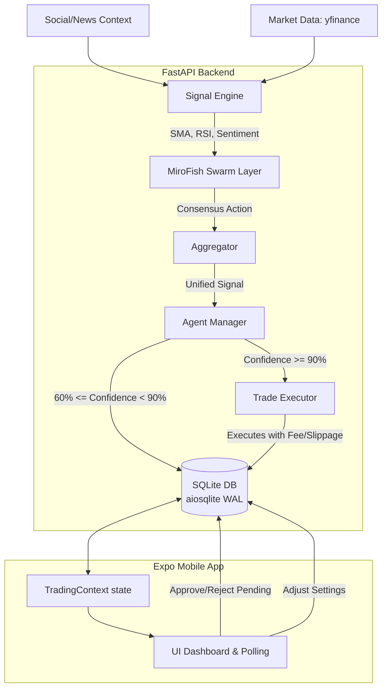
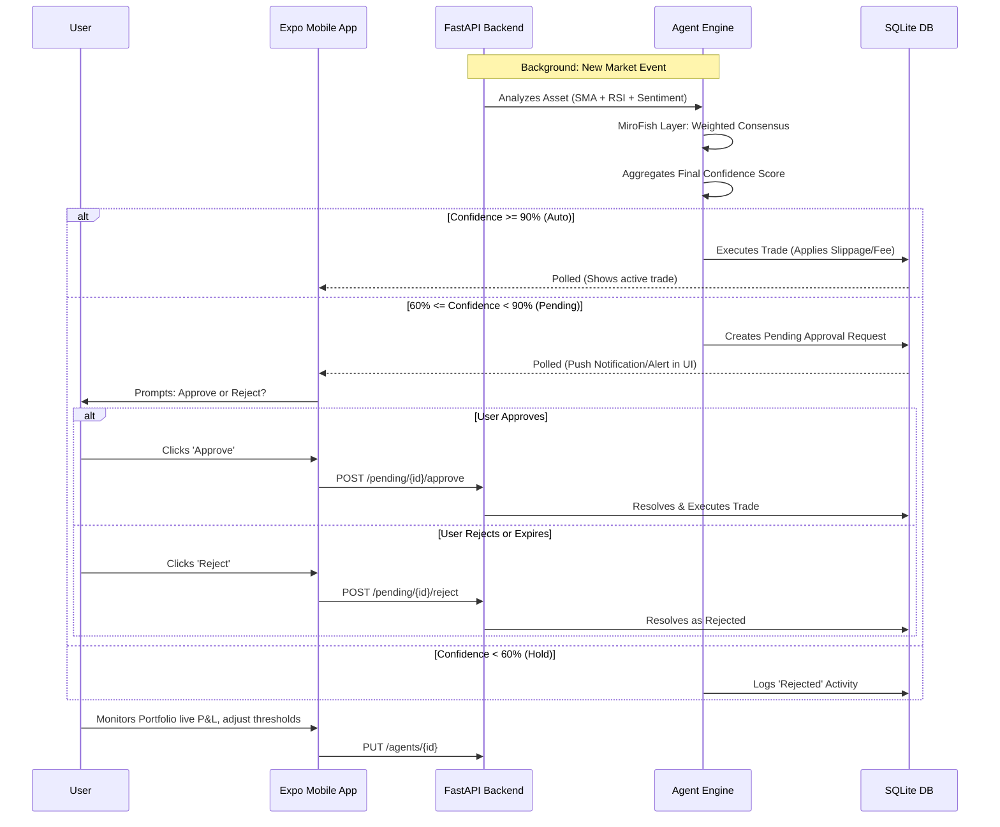

# GDGOC Suffa: Autonomous Multi-Agent Trading Simulator
**Comprehensive Project Details & Context**

This document provides exhaustive, 100% fact-checked details about the GDGOC Suffa Trading Simulator project. It covers the core context, system architecture, user journeys, project structure, and file-by-file breakdowns based on the actual codebase.

---

## 1. Project Overview & Context

**Event:** Build With AI 2026 Hackathon (GDG on Campus DHA Suffa University & impetus SYSTEMS)

**The Problem:**
Retail traders often lose money because they trade emotionally or chase social media hype. Institutional traders win because they utilize systematic approaches that validate hype against market structure.

**The Solution:**
A real-time, autonomous trading simulator that mirrors quantitative trading desks. It features multiple AI agents that evaluate social media sentiment, validate it against technical indicators, and execute simulated trades. To prevent rogue trading, it incorporates a human-in-the-loop control center via an Expo React Native mobile app.

**Key Concepts:**
- **Multi-Agent Consensus:** Decisions are not made by a single prompt. Signals from Sentiment (Groq LLM), Technicals (SMA, RSI), and a swarm layer (MiroFish) are aggregated to form a unified score.
- **Swarm Intelligence:** The MiroFish processing layer applies a "round-and-action" pattern to reach a consensus among conflicting indicators, penalizing signals during high market volatility.
- **Trade Simulation:** Executes trades using a persistent `aiosqlite` backend. Incorporates realistic constraints like a 0.1% trade fee, 0.05% slippage, and capital allocation guards.
- **Human-in-the-Loop:** If an agent's confidence falls in a "gray zone" (e.g., 60%-89%), trades are blocked and pushed to the mobile app for manual approval/rejection before expiry.

---

## 2. System Architecture

The architecture separates the high-frequency backend logic (FastAPI, SQLite, LangGraph) from the user-facing control center (Expo React Native).

### Core Components
*   **Signal Engine:** Orchestrates technical indicators (SMA-20, RSI-14) and sentiment analysis via Groq.
*   **MiroFish Processing Layer:** A sophisticated consensus engine that treats each indicator as a "swarm agent." It calculates a weighted direction strength, consensus ratio, and applies a volatility penalty based on recent price standard deviation.
*   **Indicator Weights:** SMA (25%), RSI (25%), Sentiment (30%), MiroFish Swarm (20%).
*   **Agent Personas:**
    *   **ORION:** Event-driven signal trading (Default Capital: $200k, Threshold: 85%)
    *   **ATLAS:** Technical momentum (Default Capital: $150k, Threshold: 78%)
    *   **SENTINEL:** Contrarian reversal (Default Capital: $150k, Threshold: 92%)

---

## 3. User Journey

The user journey focuses on governance and oversight of the autonomous system.

---

## 4. Project Structure & File Breakdown

### Root Directory
*   `README.md`: The primary pitch document, explaining the "why", how the multi-agent system runs, and local execution commands.
*   `PROJECT_DETAILS.md`: (This file) The source of truth for architecture and codebase mapping.
*   `hack-details.md`: The Hackathon rulebook and rubric.
*   `sentiment-agent-handoff.md`: Architecture instructions for sentiment agent implementation.

### Backend (`api/`)
**Core Framework & Config:**
*   `api/main.py`: FastAPI application entry. Handles routes for Signals, Agents, Portfolio, Trades, and Pending approvals.
*   `api/config.py`: System constants: Groq keys, indicator weights, slippage rates, and agent profiles.
*   `api/database.py`: Async SQLite layer using `aiosqlite`. Manages WAL mode for high-concurrency polling and thread-safe trade execution.

**Engines & Business Logic (`api/engine/`):**
*   `signal_engine.py`: The primary pipeline. Fetches data, runs all indicators, and triggers the MiroFish consensus layer.
*   `mirofish_layer.py`: **(NEW)** Implements swarm consensus. Converts indicator outputs into "SwarmActions," groups them into "SwarmRoundSummaries," and applies weighted voting and volatility-based confidence decay.
*   `agent_manager.py`: The decision engine. Maps confidence scores to agent thresholds to determine if a trade is executed, queued for approval, or discarded.
*   `trade_executor.py`: Simulation logic for slippage, fees, and realized/unrealized P&L calculation.

**Indicators:**
*   `api/indicators/`: Modular indicator logic for `sma.py`, `rsi.py`, and `sentiment.py`.
*   `api/indicators/aggregator.py`: Weights the multi-source signals into a single score.

### Frontend (`expo-app/`)
**State & Networking:**
*   `expo-app/src/context/TradingContext.tsx`: Manages the global state. Automatically detects the developer's machine IP for zero-config backend connection. Polls the backend every 8 seconds.
*   `expo-app/src/types.ts`: Strictly typed interfaces matching the backend's Pydantic models.

**UI & Interaction:**
*   `expo-app/src/screens/`: High-fidelity screens for Home, Portfolio (active positions), Agents (threshold tuning), Activity (historical logs), and Settings.
*   `expo-app/src/components/`: Reusable "Glassmorphism" styled cards and charts for real-time telemetry display.
